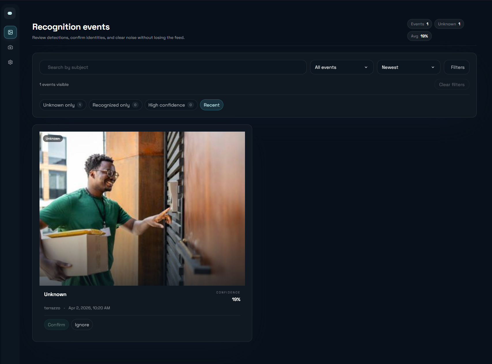
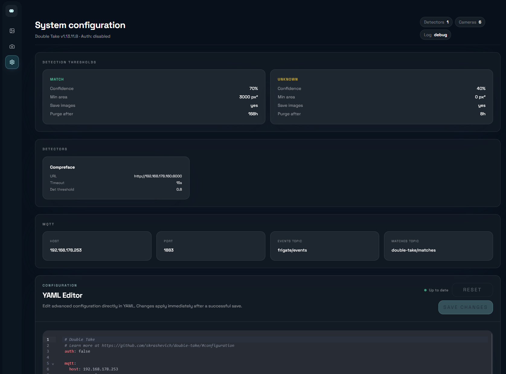
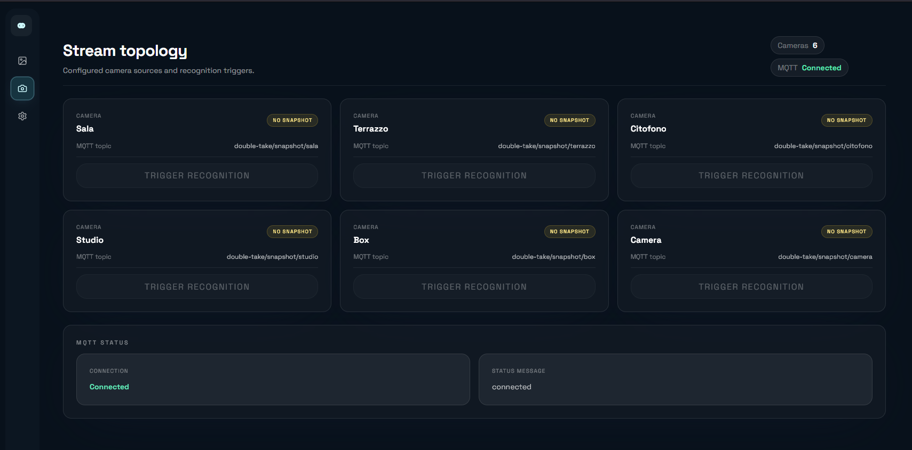

# Double Take

Double Take is a unified web UI and Node.js API for face-recognition event processing, match review, and training workflows.

## Features

- Unified UI + API served from one backend process
- Real-time recognition pipeline for camera snapshots and MQTT events
- Match review and bulk actions (confirm, ignore, reprocess)
- Training workflows from uploaded files, URLs, or match IDs
- Config editing via YAML and JSON API responses
- MQTT status and publish/subscribe integration support
- Optional JWT-based API protection

## Screenshots





## Architecture Overview

High-level runtime flow:

camera -> snapshot -> detector(s) -> match normalization -> storage/db -> UI/API response

Main building blocks:

- Frontend: Vue 3 app using composables and a typed service layer
- Backend: Express-based Node API under `/api`
- Storage: `.storage` folder for config, media, DB, and temporary assets

Detailed architecture documentation: [docs/architecture.md](docs/architecture.md)

## Frontend

The modern frontend lives in `frontend/src` and is organized by feature:

- App shell and routing in `frontend/src/app`
- Feature-level composables (for example config and matches)
- Service layer for backend integration:
  - `frontend/src/shared/api/http.ts`
  - `frontend/src/features/*/services/*.ts`

Environment-derived API base URL is generated from browser location and ingress path in `frontend/src/shared/config/env.ts`.

## Backend

The backend API lives in `api/src` and is mounted at:

- `/api` (or `${ui.path}/api` when `ui.path` is configured)

Route modules are grouped by domain in `api/src/routes`, with business logic in `api/src/controllers` and reusable logic in `api/src/util`.

## Installation

### Docker (primary)

This is the recommended production path.

Build image:

```bash
docker build -f .build/Dockerfile -t double-take:local .
```

Run container with persistent storage volume mount:

```bash
docker run -d --name double-take \
  -p 3000:3000 \
  -v ${PWD}/.storage:/.storage \
  double-take:local
```

Open:

- UI: `http://localhost:3000`
- API base: `http://localhost:3000/api`
- Swagger UI (if enabled by this branch): `http://localhost:3000/api/docs`

### Docker Compose

A compose file is included at project root:

```bash
docker compose up -d
```

### Manual (dev mode)

Requirements:

- Node.js >= 20

API setup:

```bash
cd api
npm install
npm run debug
```

Frontend setup:

```bash
cd frontend
npm install
npm run dev
```

Frontend build command:

```bash
cd frontend
npm run build
```

## Configuration

Runtime config is loaded from:

- `./.storage/config/config.yml`

Important notes:

- The YAML file is merged with defaults from backend source (`api/src/constants/defaults.js`).
- Secrets can be referenced with `!secret` and resolved from `./.storage/config/secrets.yml`.

Full configuration reference: [docs/configuration.md](docs/configuration.md)

## API Overview

The backend API is mounted at `/api` and uses route modules in `api/src/routes`.

Core groups:

- Matches (`/api/match`, `/api/train/...`)
- Config (`/api/config`)
- Cameras (`/api/camera/:camera`)
- System/Status (`/api/status/mqtt`)

Human-readable API docs: [docs/api.md](docs/api.md)

OpenAPI references:

- JSON: [api/openapi.json](api/openapi.json)
- Existing YAML reference: [docs/api/openapi.yaml](docs/api/openapi.yaml)

## Tech Stack

- Frontend: Vue 3, TypeScript, Pinia, Vue Router, Vite
- Backend: Node.js, Express, Joi validation
- Storage/Data: filesystem + SQLite (`better-sqlite3`)
- Messaging: MQTT
- Tooling: Docker, Playwright

## Roadmap

- Expand and version OpenAPI coverage for all implemented routes
- Add response examples for all detector integrations
- Add CI checks for OpenAPI schema validation
